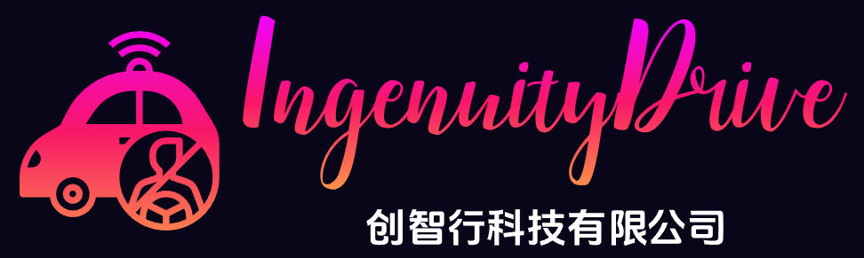
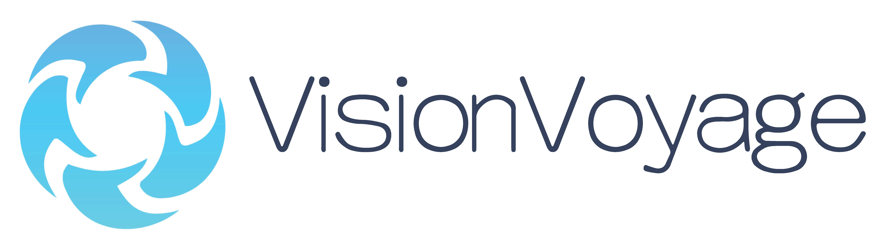
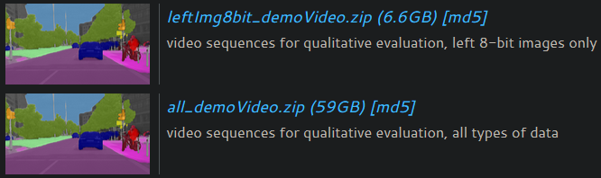

# VisionVoyage

---

## Introduction

This project is associated with the courses `Basis of Innovation and Entrepreneurship ＆ Engineering Design Practice (创新创业基础与工程设计实践)`  and `Productive Practice (生产实习)` of the CS major at ZZU.

I led a simulation of a software company called `IngenuityDrive (创智行)` and developed a software called `VisionVoyage`. We need to play different roles:

 **Company Positions**

|  Name  | Major |            Position             |                     Main Responsibility                      |
| :----: | :---: | :-----------------------------: | :----------------------------------------------------------: |
| M0rtzz |  CS   | Manager and Technical Developer | Fully responsible for product development and documentation, leading the team to ensure the smooth completion of the project. |
|   \    |  CS   |                \                |                              \                               |
|   \    |  CS   |                \                |                              \                               |
|   \    |  CS   |                \                |                              \                               |
|   \    |  SE   |                \                |                              \                               |

VisionVoyage is an autonomous driving simulation system that leverages  fisheye cameras and other sensing technologies, providing the following  capabilities:

- Fisheye transformation of a single standard image
- Mosaic of fisheye images from multiple standard images
- Semantic segmentation of fisheye (e.g., [WoodScape](https://woodscape.valeo.com/woodscape)) and standard (e.g., [Cityscapes](https://www.cityscapes-dataset.com)) images in street scenes
- Semantic segmentation of video in street scenes (such as videos stitched from [continuous datasets published by Cityscapes](https://www.cityscapes-dataset.com/downloads))
  -  

- Simulated driving
- Autonomous driving simulation
- Shooting of simulated fisheye semantic segmentation dataset
- Experience with a variety of simulated sensors, including:
  - Camera Fisheye
  - Camera RGB
  - Camera Depth (Raw)
  - Camera Semantic Segmentation (Raw)
  - Camera Semantic Segmentation (Cityscapes Palette)
  - Camera Instance Segmentation (Raw)
  - Dynamic Vision
  - Optical Flow
  - Camera Normals
  - Lidar (Ray-Cast)
  - etc.

For more detailed explanation and demonstration, please refer to [the demonstration video I have recorded](./docs/DEMONSTRATION.md).

## Get Started

Please refer to [GET_STARTED.md](./docs/GET_STARTED.md) for installation and [DOWNLOAD_DATASETS.md](./docs/DOWNLOAD_DATASETS.md) for dataset preparation.

## Dependency

### UE

[https://github.com/CarlaUnreal/UnrealEngine](https://github.com/CarlaUnreal/UnrealEngine)

### GUI

[https://github.com/Wanderson-Magalhaes/Modern_GUI_PyDracula_PySide6_or_PyQt6](https://github.com/Wanderson-Magalhaes/Modern_GUI_PyDracula_PySide6_or_PyQt6)

### CARLA

[https://github.com/carla-simulator/carla](https://github.com/carla-simulator/carla)

### Payment

[https://github.com/fzlee/alipay](https://github.com/fzlee/alipay)

### Generate PDF

[https://github.com/libharu/libharu](https://github.com/libharu/libharu)

### Matrix Operation

[https://gitlab.com/libeigen/eigen](https://gitlab.com/libeigen/eigen)

### Image Processing

[https://github.com/opencv/opencv](https://github.com/opencv/opencv)

[https://github.com/opencv/opencv_contrib](https://github.com/opencv/opencv_contrib)

### HuggingFace Mirror Site

[https://github.com/padeoe/hf-mirror-site](https://github.com/padeoe/hf-mirror-site)

### Video Semantic Segmentation

[https://github.com/TomMao23/multiyolov5](https://github.com/TomMao23/multiyolov5)

### Image Semantic Segmentation

[https://github.com/open-mmlab/mmsegmentation](https://github.com/open-mmlab/mmsegmentation)

### AES (Advanced Encryption Standard)

[https://github.com/weidai11/cryptopp](https://github.com/weidai11/cryptopp)

### Merge PDF (CLI)

[https://github.com/MeteorPackaging/pdftk](https://github.com/MeteorPackaging/pdftk)

### Pipe Viewer (CLI)

[https://codeberg.org/a-j-wood/pv](https://codeberg.org/a-j-wood/pv)

### Archive Utility (CLI)

[https://git.savannah.gnu.org/cgit/tar.git](https://git.savannah.gnu.org/cgit/tar.git)

### Download Utility (CLI)

[https://github.com/aria2/aria2](https://github.com/aria2/aria2)

[https://gitlab.com/gnuwget/wget](https://gitlab.com/gnuwget/wget)

### Package Manager (CLI)

[https://github.com/conda/conda](https://github.com/conda/conda)

### Steam Locomotive (CLI)

[https://github.com/mtoyoda/sl](https://github.com/mtoyoda/sl)

### Large Files Manager (CLI)

[https://github.com/git-lfs/git-lfs](https://github.com/git-lfs/git-lfs)

### X Window Manager Tool (CLI)

[https://github.com/Conservatory/wmctrl](https://github.com/Conservatory/wmctrl)

### HTTP Request Verification (CLI)

[https://github.com/curl/curl](https://github.com/curl/curl)

### Parallel Implementation of Gzip (CLI)

[https://github.com/madler/pigz](https://github.com/madler/pigz)

### clang/clang++ (CLI, OPTIONAL)

[https://github.com/llvm/llvm-project](https://github.com/llvm/llvm-project)
